# SVM
# 1- Data 
Make data in 2 categories 1 and -1 using polar coordinates so that the separation curve is a circle, for example

  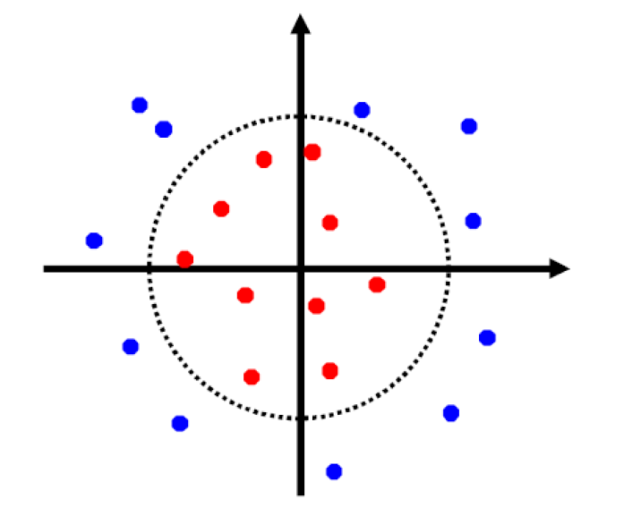
  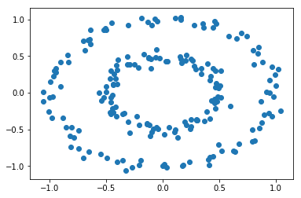

* 1. Create an SVM learner with linear SVM algorithm and train data set. Calculate the classification accuracy on the test and train sets. Then draw the curve of the margins and the decision boundary, and specify the Support Vectors on it.
  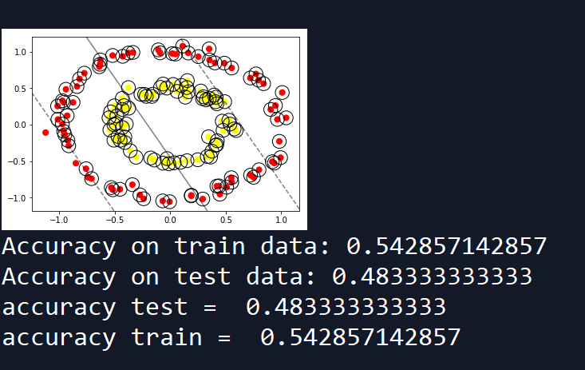
  
* 2. Create an SVM learner with nonlinear SVM algorithm in soft SVM mode. Adjust the soft SVM parameter using the cross-validation method to give the best accuracy on the validation set. Calculate the classification accuracy on the test and train sets in this best selected value. Then draw the curve of the margins and the decision boundary, and specify the support vectors on it.
  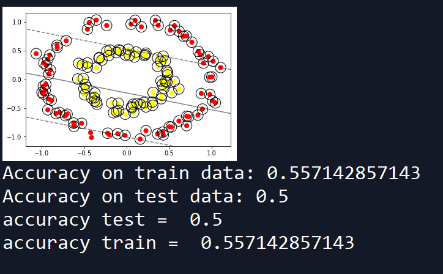
  
* 3. Create an SVM learner in kernel mode with nonlinear SVM algorithm. Select RBF kernel and Grade 2 and 3 polynomial kernels. You can select the best kernel based on the accuracy of the validation set by cross-validation. Calculate the accuracy of the classification on the test and train sets in this best selected kernel. Then draw the curve of the margins and the decision boundary, and specify the support vectors on it.

  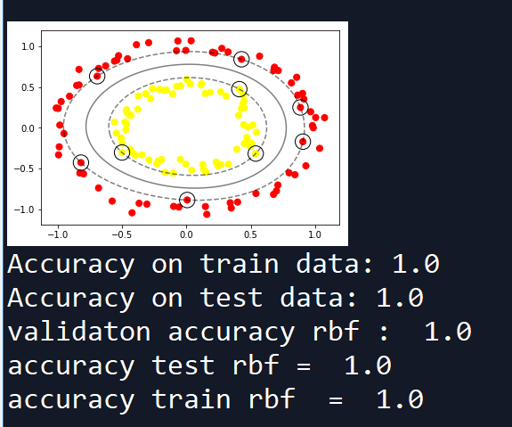
  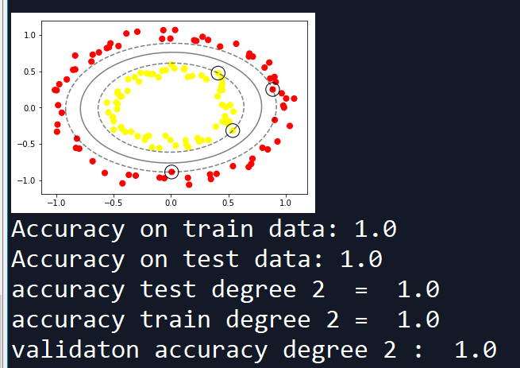
  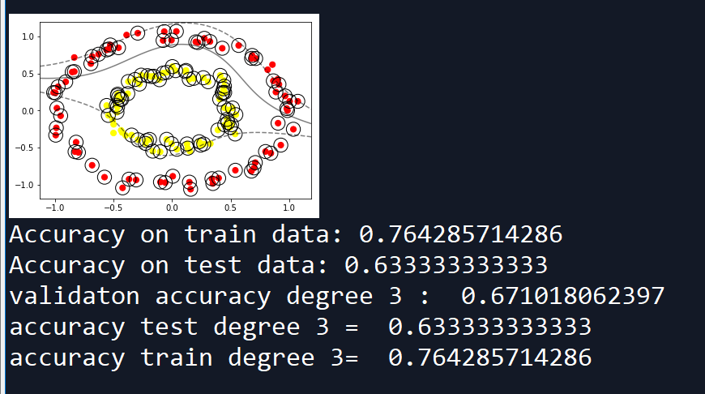

# 2- Iris Dataset
* one versus all
* 1. Create an SVM learner using the linear SVM algorithm and the train data set using the 4-fold cross validation method. Note: Test and training data should be selected by the same 4-fold method (accuracy rate)

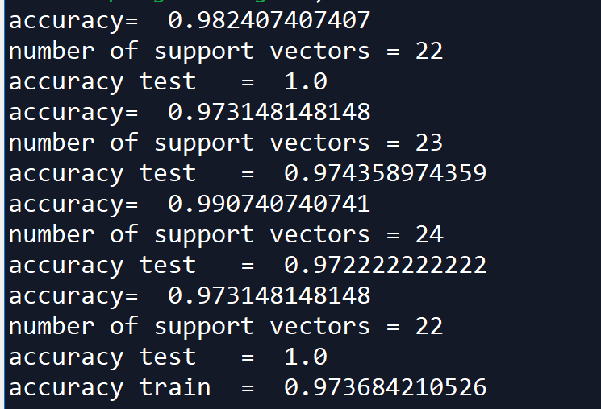

Calculate the classification on the train and test sets and report the final accuracy of the 4-fold system.
Then specify the number of support vectors in each case.
* 2. In the same mode as the previous 4-fold cross validation, with the nonlinear SVM algorithm in the soft SVM mode a learner
Build SVM. The soft SVM parameter uses the validation data that you set from the tutorial in each mode
You get, set to give the best accuracy on the validation set. Accuracy change curve
Draw a classification on the validation data based on the value of C. The degree of classification accuracy on train sets
And test In this, calculate the best selected value. Then specify the number of support vectors and the mode
Compare before.

  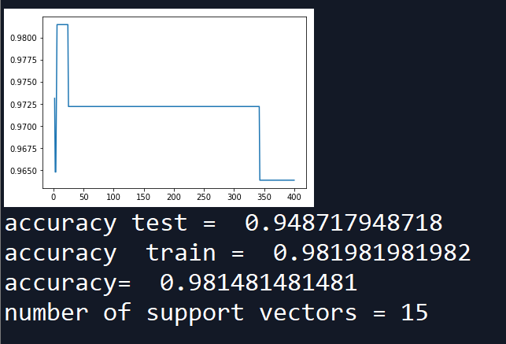
  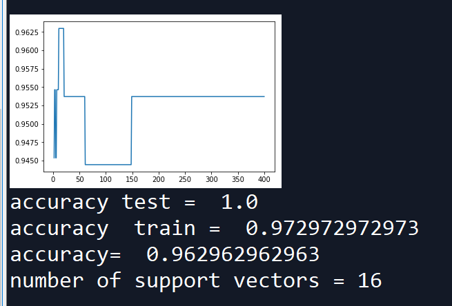

  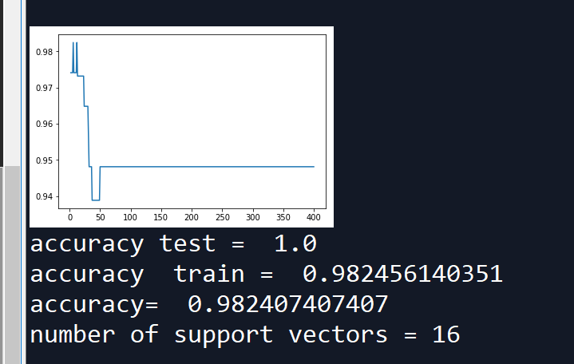
  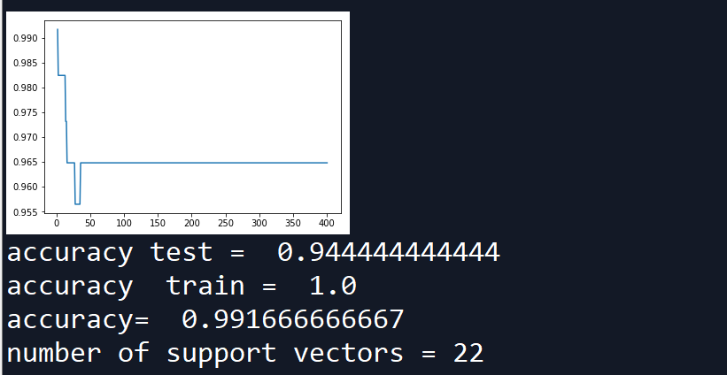

* 3. In the same mode as the previous 4-fold cross validation, with the nonlinear SVM algorithm in the kernel mode of an SVM learner
Build. Select RBF kernel and polynomial kernel. You can choose the best kernel based on accuracy
Perform validation on the set. The degree of classification accuracy on the train and test sets in this best
Calculate the selected kernel. Then specify the number of support vectors.

  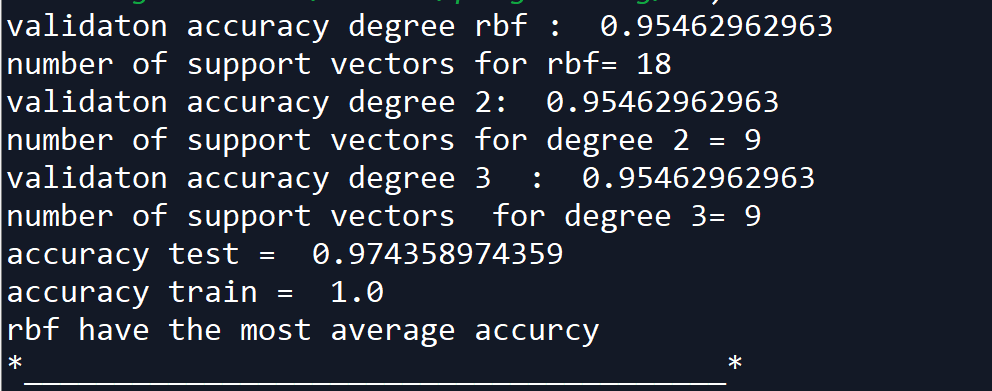
  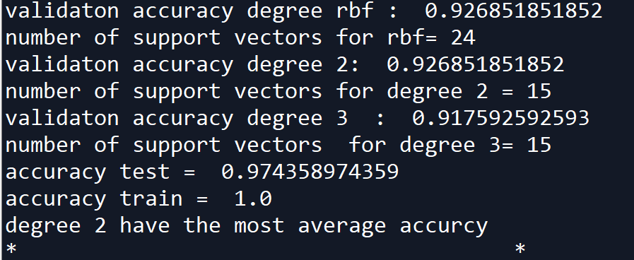

  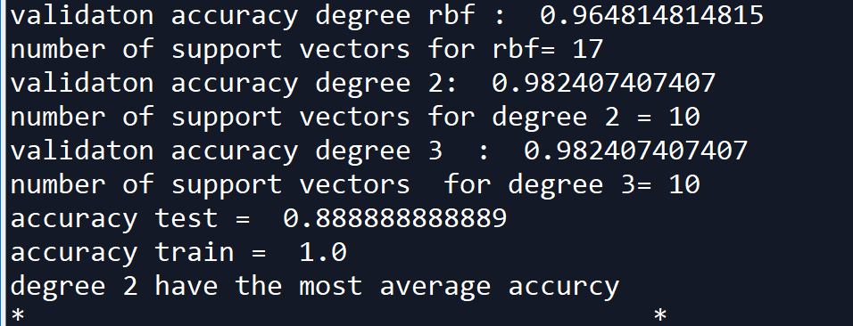
  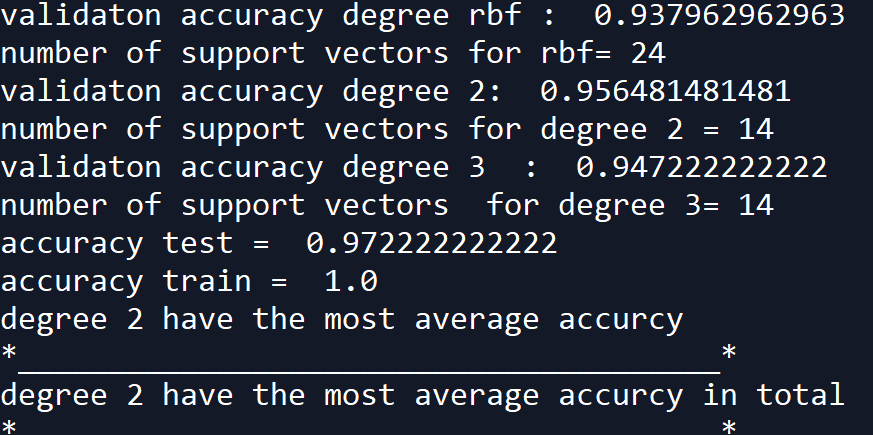

* 4. In the same mode as the previous 4-fold cross validation, create an SVM learner with the nonlinear SVM algorithm in the combined kernel and soft SVM mode. Select the best kernel for the previous step. Using the soft SVM parameter
Adjust the validation data to give the best accuracy on the validation set. The degree of accuracy
Calculate the classification on the train and test sets at this best value. Then the number of support vectors
Specify.

  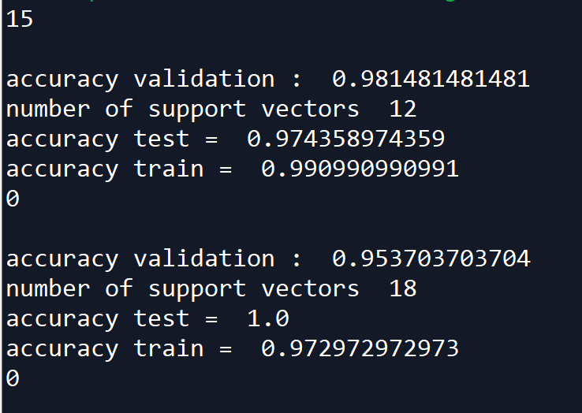
  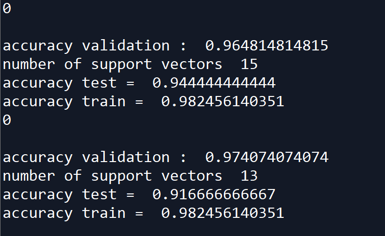

